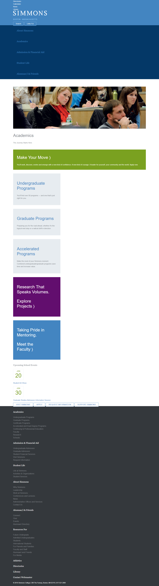

# CLASS TASKS - CLASS 02

Task guidelines for basic html layout task.

**Dated: 29th April 2020**

## Objective
> To understand the layout of a website. To learn breaking tasks into simpler modules.

## Prerequisites 

#### HTML 

- Hyperlinks
- Semantic tags
- Presentational tags
- Layout

#### CSS

- Basic style properties
- Selectors
- Color convention

You have studied the offline lessons given to you and have taken quizzes to self-assess yourself.

## Overview of the Task

The task is to design a website for college students similar to the mockup. The task is divided into two parts. You will cover the first part in this class and the second part in the next class.The screenshot attached is the first part of the website which we will cover today. Once you start to design your website, there are certain steps to be considered:

## Steps to consider while creating the layout.
Never start to design a website without following a proper step by step procedure. Following are certain steps that you should always bring into practice when creating the website.

#### Step 01:
> Analyze the layout of the website carefully to identify the different sections present on it. 

#### Step 02:
> Identify the semantic tags both having visual effect and not having visual effect. Example notice if there is any sidebar or a list of elements so that you know which html tags you will require.

#### Step 03:
> If there are links present on the website, use hyperlinks for those parts.

#### Step 04:
> Once you have identified the visual and non visual semantic tags, the second step is to start building the html markup of your project. You should be careful that you enclose all related content in one singular tag. Like enclosing header elements in a header tag. This helps in styling them easily too.

#### Step 05:
> Elements that are related to one another in a particular section can be placed in div. This will allow you to give similar style properties to them in one go. 

#### Step 06:
> Use comments in html and css files to label each section so that you can easily access a certain section by simply looking at the comments

#### Step 07:
> Use appropriate naming convention for the class names you give to html tags. This is very important so that later you do not find it difficult to manage your stylesheets.

#### Step 08:
> Time to add CSS to your html markup. It is a good practice to always use an external stylesheet to style html tags.

#### Step 09:
> Start with using wildcard property to give a similar look and feel to your entire project. If there is a property you want throughout the design, declare it in the wildcard property. 

#### Step 10:
> It is a good practice to use shorthand properties to make your code appear neat. For example if you want to set margin for all four directions, use the shorthand property of margin instead of individually declaring it for each direction.

#### Step 11:
> Notice which elements of the website require the entire row width and which elements should be placed side by side. Use correct CSS property to adjust the default display behaviour of tags.

#### Step 12:
> Now you can start adding background colors to the elements of your website. Also work on colors of font and specify properties like font size and family. 

#### Step 13:
> See if you have used hyperlinks in your project, if so then use style properties to change the default hyperlink behaviour and style it so that it looks exactly how you want.[HINT: Use box model properties to change appearance of hyperlinks]

#### Step 14:
> Once you have all elements with proper colors and display, start working on aligning your text. You have studied alignment in the box model lesson.

#### Step 15:
> After completing a section, compare it with the mockup to see if you have missed out anything.
	
#### Step 16:
> Finally, you can compare your entire design with the design provided in the mockup.

### Dated: 2nd May 2020

#### Step 17:
> Now since you have written all html markup and added the basic styles to you tags, it's time to position the elements according to the final mockup.

#### Step 18:
> Observe the navbar first, it has 3 main things, nav options on the right, heading in the center and some input tags on the right corner. You have already written the html markup for it. 

#### Step 19:
> To align them all in one single line, you first need to enclose each part in a div i.e enclose nav items in one div, center SIMMONS heading and text in one div and the input buttons in another div and assign the same class to each div.

#### Step 20:
> Now you can give the display property on the class you assigned to the divs and set it to inline-block. Remember CSS also provides you to write 'inline' in display. The main difference between 'display: inline' and 'display: inline-block' is that when you give an element an inline property, you can not change its margin and padding values. But when you use inline-block, you have control over the padding and margin of an element. A better practice is to use inline-block. Similarity between both is that your element does not occupy the entire browser width

#### Step 21:
> If you want to give some space between the input tags or the overall content inside the top header, simply increase the padding values

#### Step 22:
> The next navbar will also be styled the same way i.e you will set display property and assign inline-block to it for the elements to appear in a single row. 

#### Step 23:
> Observe that the tab which is currently active has a different color, use pseudoclasses(HINT: hover pseudoclass) to create that effect.

#### Step 24:
> Now let's come to the image. The image has text written on it. You can also create that by simply using position property and set it to absolute. Remember to always assign position to relative to the tag you want the text to appear on, in this case we will set the image tag to position relative.

#### Step 25:
> If you see further, we have a green box occupying the whole row space of the browser. If you have used div to enclose that, no need to seperately assign display property of block, because all div elements have display block by default.

#### Step 26:
> The boxes that appear in a single row are simply because of assigning the display property and setting it to inline-block like we discussed in the previous steps. You can adjust the width of the box by assigning width property to the box. If you want to give similar effect to more than one element, give them a similar class name. In this way you will only need to style them once.

#### Step 27:
> Next, the space you see in the button text and the border is because of the padding property.

#### Step 28:
> Now let us see the footer, if you observe it seems like there are 4 columns in the footer element with each containing certain text. You can also make 4 div elements and enclose each column content in each div. Give a similar class name to these 4 divs and set width such that all 4 columns appear in the same row. Again you will need to use inline-block to make sure each div does not occupy the browser entire width.

#### Step 29:
> Lastly if you see, the browser width is 100%. If you want 4 columns of the same size, simply give each div a width of 23%. Leave two percent for margin property. In this way you will have columns of exact width.   

###### GOOD LUCK!

### MOCKUP CONTENT

(https://docs.google.com/document/d/1rS_iSRWggC_9XeFkzot-uC_9RQ0_QTz6R0RhwsYLiWU/edit?usp=sharing)

### MOCKUP IMAGE 

